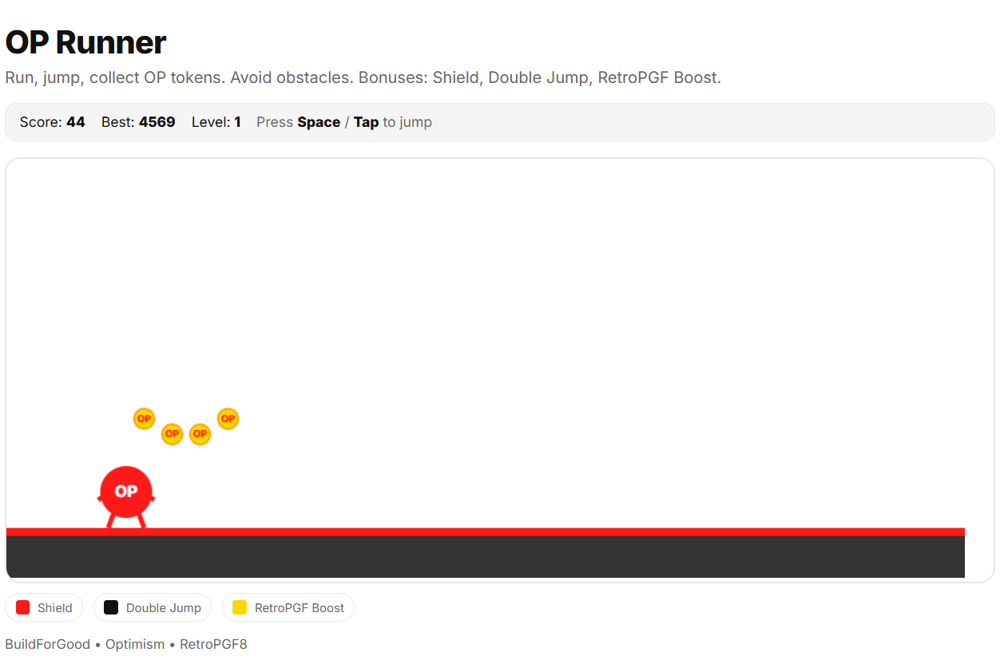
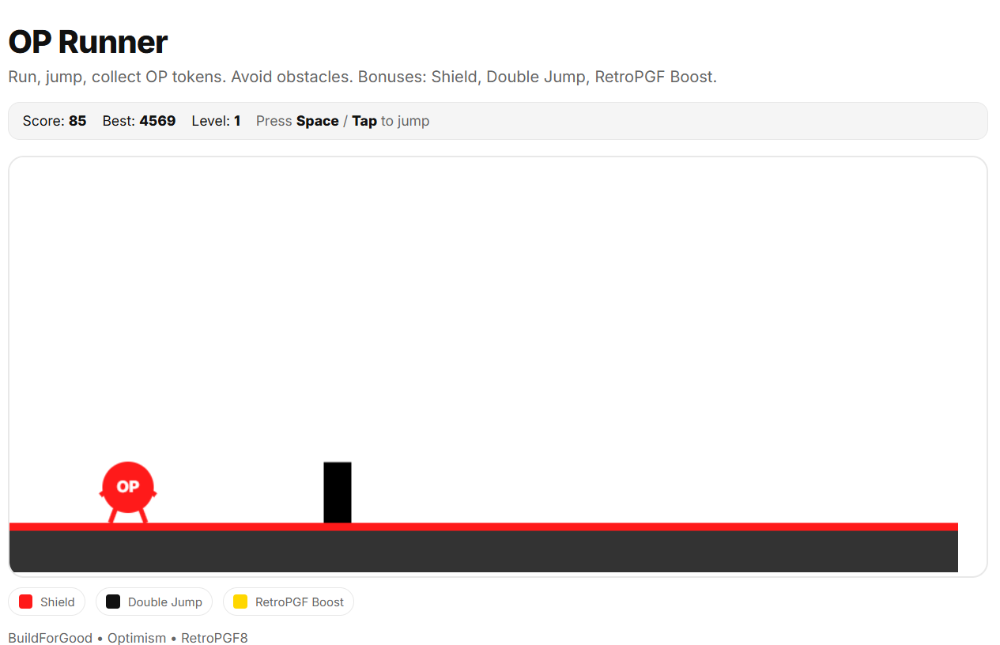
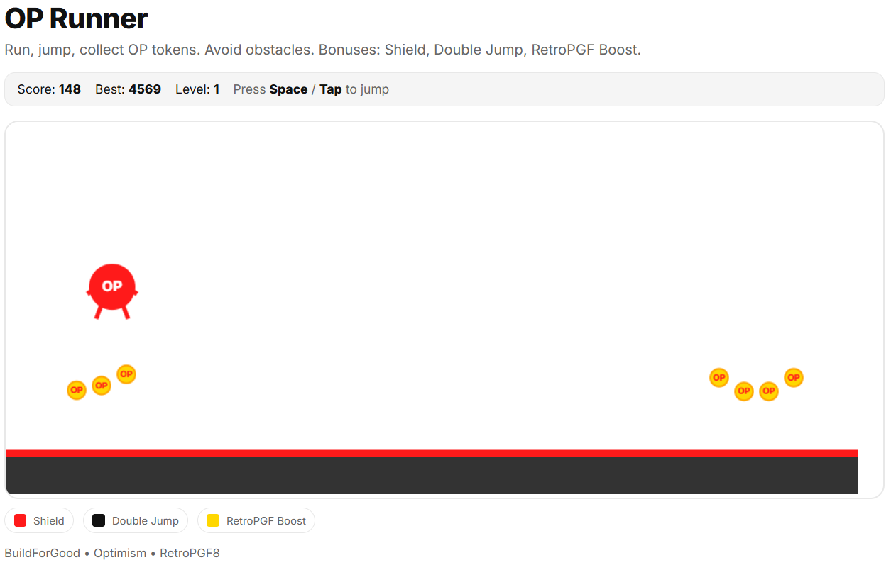

# OP Runner — BuildForGood

Simple, pretty and ready-to-host HTML5 canvas runner in Optimism's style.

## Controls
- **Jump:** Space / Up / W or tap on mobile.
- **Double Jump:** collect the black icon bonus (2J). Lasts ~10s.
- **Shield:** collect the red icon (S). Absorbs one hit.
- **RetroPGF Boost:** collect the gold ⚡. Invincible + faster for ~5s.

## Levels
- Score increases over time and with coins.
- Every **200 score** → level up → speed increases and a banner shows.

Enjoy, and build for public goods!
